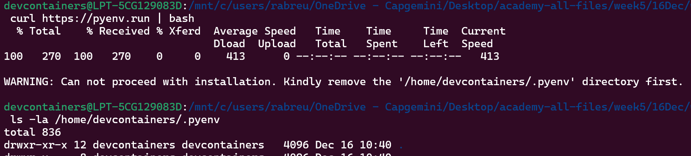

# pyenv

You can use this to manage multiple python versions

(I use this in every project)

## Installation on Windows

The official pyenv does not support Windows

https://github.com/pyenv/pyenv


pyenv for Windows

https://github.com/pyenv-win/pyenv-win

Steps:
* Install pyenv-win in PowerShell
    ```powershell
    Invoke-WebRequest -UseBasicParsing -Uri "https://raw.githubusercontent.com/pyenv-win/pyenv-win/master/pyenv-win/install-pyenv-win.ps1" -OutFile "./install-pyenv-win.ps1"; &"./install-pyenv-win.ps1"
    ```
* Reopen PowerShell
* Run `pyenv --version` to check if the installation was successful.

    

The installation created a `~/.pyenv/` directory


## Installation on Ubuntu

```bash
# remove the existing .pyenv directory
rm -rf /home/devcontainers/.pyenv

# run the automatic installer in Linux
curl https://pyenv.run | bash

# edit the shell's configuration file (~/.bashrc in this case)
export PYENV_ROOT="$HOME/.pyenv"
command -v pyenv >/dev/null || export PATH="$PYENV_ROOT/bin:$PATH"
eval "$(pyenv init --path)"
eval "$(pyenv virtualenv-init -)"
# reload your shell
source ~/.bashrc

# verify it is working
pyenv --version
```

here's the prints and some trouble i run into (looking back, i could have used the existing pyenv)




## Updating and Uninstalling

To uninstall, remove that folder

```bash
rm -rf ~/.pyenv
```

To update (since we installed via the installer), run in a Powershell terminal
```powershell
&"${env:PYENV_HOME}\install-pyenv-win.ps1"
```

## Usage

From the repo:

<ul dir="auto">
<li>To view a list of python versions supported by pyenv windows: <code>pyenv install -l</code></li>
<li>To filter the list: <code>pyenv install -l | findstr 3.8</code></li>
<li>To install a python version:  <code>pyenv install 3.5.2</code>
<ul dir="auto">
<li><em>Note: An install wizard may pop up for some non-silent installs. You'll need to click through the wizard during installation. There's no need to change any options in it. or you can use -q for quiet installation</em></li>
<li>You can also install multiple versions in one command too: <code>pyenv install 2.4.3 3.6.8</code></li>
</ul>
</li>
<li>To set a python version as the global version: <code>pyenv global 3.5.2</code>
<ul dir="auto">
<li>This is the version of python that will be used by default if a local version (see below) isn't set.</li>
<li><em>Note: The version must first be installed.</em></li>
</ul>
</li>
<li>To set a python version as the local version: <code>pyenv local 3.5.2</code>.
<ul dir="auto">
<li>The version given will be used whenever <code>python</code> is called from within this folder. This is different than a virtual env, which needs to be explicitly activated.</li>
<li><em>Note: The version must first be installed.</em></li>
</ul>
</li>
<li>After (un)installing any libraries using pip or modifying the files in a version's folder, you must run <code>pyenv rehash</code> to update pyenv with new shims for the python and libraries' executables.
<ul dir="auto">
<li><em>Note: This must be run outside of the <code>.pyenv</code> folder.</em></li>
</ul>
</li>
<li>To uninstall a python version: <code>pyenv uninstall 3.5.2</code></li>
<li>To view which python you are using and its path: <code>pyenv version</code></li>
<li>To view all the python versions installed on this system: <code>pyenv versions</code></li>
<li>Update the list of discoverable Python versions using: <code>pyenv update</code> command for pyenv-win <code>2.64.x</code> and <code>2.32.x</code> versions</li>
</ul>


concepts:
* you use pyenv to manage (install and select) multiple Python versions


* get a specific version of Python

    `pyenv install 3.10.0`

    it must be one of the versions listed in the command below

    `pyenv install --list`

    

    

    

* list the versions that are installed and which one is active

    `pyenv versions`

    in the image below, i have two versions installed but none of them is active
    

* you can set a python version in different ways: local, global and shell installations

    * globally means the entire system uses it unless there's a more specific (shell > local > global)

    eg. 
    
    `pyenv shell 3.10.0` sets that version for current shell (resets after you kill it)

    `pyenv local 3.10.0` sets a version for the directory the command is run on

    `pyenv global 3.10.0` sets a global version

    in the image below, i set a local version for that folder
    


on WSL, i got some trouble with using it (after the installation). I followed these steps

```bash
# install a C compiler and other dependencies to build Python
sudo apt update
sudo apt install -y build-essential libssl-dev zlib1g-dev libbz2-dev \
libreadline-dev libsqlite3-dev wget curl llvm libncurses5-dev libncursesw5-dev \
xz-utils tk-dev libffi-dev liblzma-dev python3-openssl git

# verify gcc installation
gcc --version

# and then it worked
pyenv install 3.10.0
pyenv global 3.10.0
python --version
```