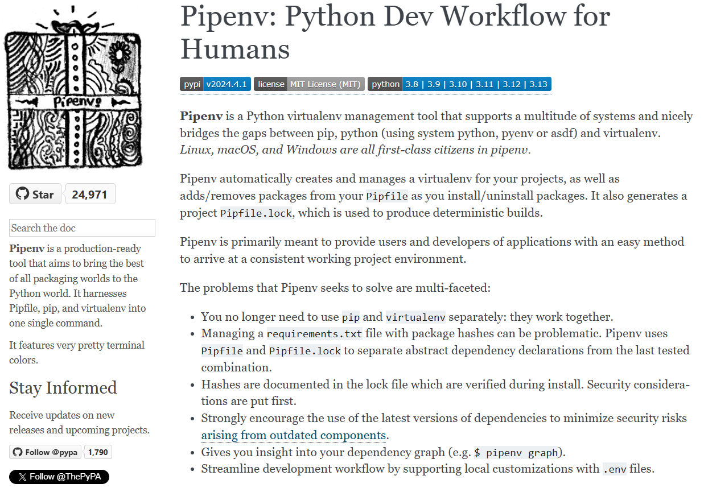
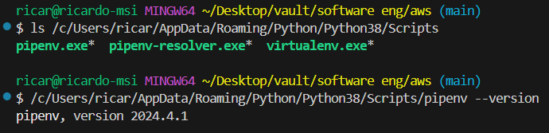
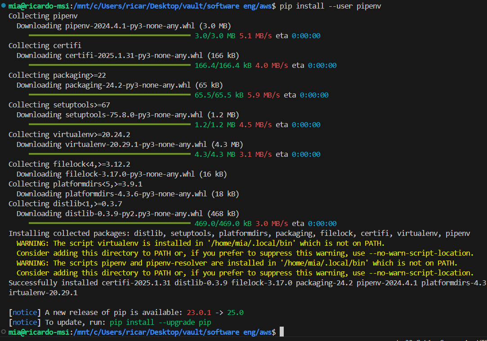
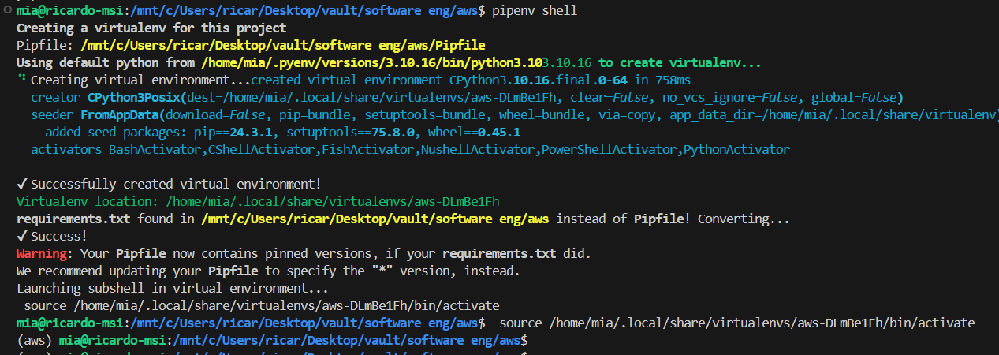

# pipenv

## installing pipenv

* <https://pipenv.pypa.io/>



```shell
pip install --user pipenv
```

This command instructs pip to install Pipenv in your user space. The `--user` option ensures that Pipenv is installed in the user install directory for your platform.





Add it to the PATH environment variable (of the User or of the System)

```shell
pipenv
# if you get `pipenv: command not found`...
# find pipenv's installation path
pip show pipenv
# look for the Location field—it shows where Pipenv is installed
```

## creating a virtual environment

```shell
pipenv shell
```



## installing dependencies

Use `pipenv install <package>` and `pipenv uninstall <package>`

```shell
# eg.
pipenv install matplotlib
```

the generated `Pipfile` will look something like this:

```none
[[source]]
url = "https://pypi.org/simple"
verify_ssl = true
name = "pypi"

[packages]
notebook = "*"
ipykernel = "*"
dask = {extras = ["complete"], version = "*"}

[dev-packages]

[requires]
python_version = "3.10"
```
