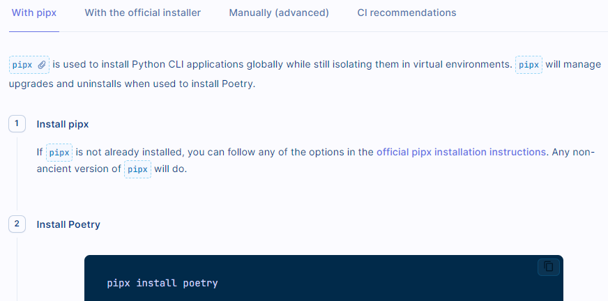
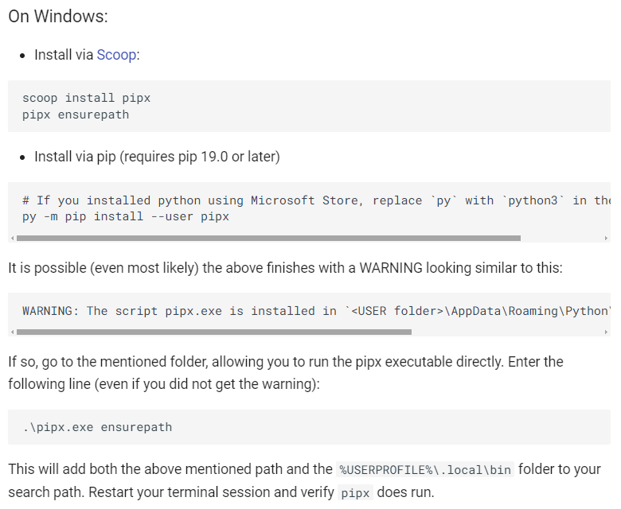
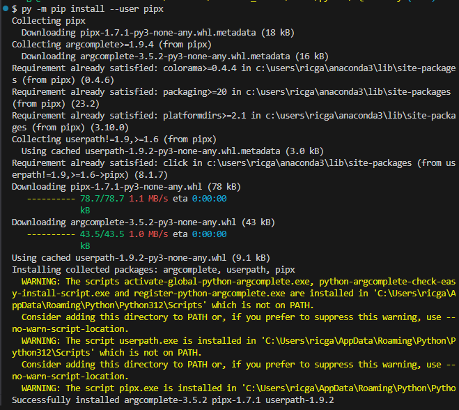
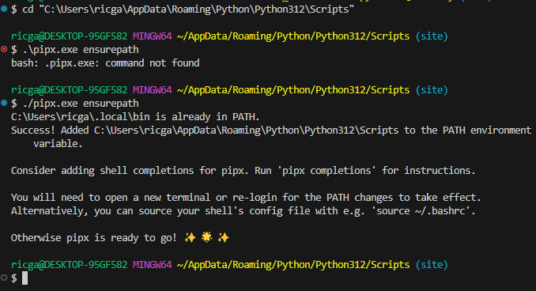
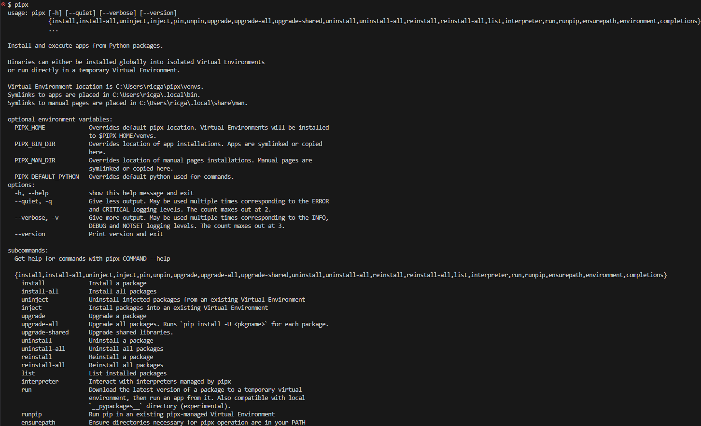

# poetry

This is an alternative to venv.

(I'm not going to use it here)

## Installing poetry

### with pipx

This seems like the easiest way, with just two steps

<https://python-poetry.org/docs/#installing-with-pipx>



#### Step 1

First step is to install pipx

<https://pipx.pypa.io/stable/installation/>

On Windows, install it via pip like this:



```bash
py -m pip install --user pipx
```





verify pipx works



#### Step 2

Install Poetry

```bash
pipx install poetry
```

concepts:

* pip vs pipx

    pip is a general Python package installer. It can be used to install libraries or cli applications with entrypoints.

    pipx is a specialized package installer. It can only be used to install packages with cli entrypoints.

    pipx and pip both install packages from PyPI (or locally)

    pipx relies on pip (and venv)

    pipx replaces a subset of pip's functionality; it lets you install cli applications but NOT libraries that you import in your code.
* Now that you have pipx installed, you can install a program:

    `pipx install PACKAGE`

## Updating and uninstalling

Update Poetry

```bash
pipx upgrade poetry
```

Uninstall Poetry

```bash
pipx uninstall poetry
```

## Usage

<https://python-poetry.org/docs/basic-usage/>