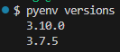

# pyenv

You can use this to manage multiple python versions

<https://github.com/pyenv/pyenv>

## Installation on Windows

The official pyenv does not support Windows


So, use `pyenv for Windows`

<https://github.com/pyenv-win/pyenv-win>

Steps:

* Install pyenv-win in PowerShell

  ```powershell
  Invoke-WebRequest -UseBasicParsing -Uri "https://raw.githubusercontent.com/pyenv-win/pyenv-win/master/pyenv-win/install-pyenv-win.ps1" -OutFile "./install-pyenv-win.ps1"; &"./install-pyenv-win.ps1"
  ```

* Reopen PowerShell
* Run `pyenv --version` to check if the installation was successful.

  

The installation created a `~/.pyenv/` directory


## Installation on Ubuntu

```bash
# remove the existing .pyenv directory
rm -rf /home/devcontainers/.pyenv

# run the automatic installer in Linux
curl https://pyenv.run | bash

# edit the shell's configuration file (~/.bashrc in this case)
export PYENV_ROOT="$HOME/.pyenv"
command -v pyenv >/dev/null || export PATH="$PYENV_ROOT/bin:$PATH"
eval "$(pyenv init --path)"
eval "$(pyenv virtualenv-init -)"
# reload your shell
source ~/.bashrc

# verify it is working
pyenv --version
```

here's the prints and some trouble i run into (looking back, i could have used the existing pyenv)


## Updating and Uninstalling

To uninstall, remove that folder

```bash
rm -rf ~/.pyenv
```

To update (since we installed via the installer), run in a Powershell terminal

```powershell
&"${env:PYENV_HOME}\install-pyenv-win.ps1"
```

## Usage

* you use pyenv to manage (install and select) multiple Python versions


* get a specific version of Python

  `pyenv install 3.10.0`

  it must be one of the versions listed in the command below

  `pyenv install --list`

  

  

  

* list the versions that are installed and which one is active

  `pyenv versions`

  in the image below, i have two versions installed but none of them is active
  

* you can set a python version in different ways: local, global and shell installations

  * globally means the entire system uses it unless there's a more specific (shell > local > global)

  eg.
  
  `pyenv shell 3.10.0` sets that version for current shell (resets after you kill it)

  `pyenv local 3.10.0` sets a version for the directory the command is run on

  `pyenv global 3.10.0` sets a global version

  in the image below, i set a local version for that folder

  

on WSL, i got some trouble with using it (after the installation). I followed these steps

```bash
# install a C compiler and other dependencies to build Python
sudo apt update
sudo apt install -y build-essential libssl-dev zlib1g-dev libbz2-dev \
libreadline-dev libsqlite3-dev wget curl llvm libncurses5-dev libncursesw5-dev \
xz-utils tk-dev libffi-dev liblzma-dev python3-openssl git

# verify gcc installation
gcc --version

# and then it worked
pyenv install 3.10.0
pyenv global 3.10.0
python --version
```
