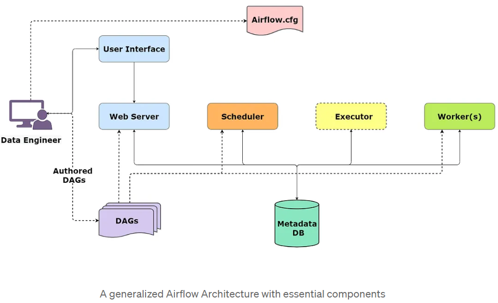
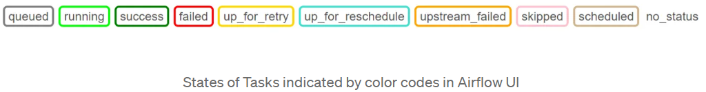

# Airflow

* Apache Airflow® is an open-source platform for developing, scheduling, and monitoring batch-oriented workflows.

* Airflow wasn't designed for

  * high-frequency, sub-minute scheduling.
  * real-time data streaming
  * simple, linear workflows with few dependencies. For those, simpler tools like cron jobs are enough
  * data processing or data storage

    Airflow was built for finite batch workflows. While the CLI and REST API do allow triggering workflows, Airflow was not built for infinitely running event-based workflows. Airflow is not a streaming solution. However, a streaming system such as Apache Kafka is often seen working together with Apache Airflow. Kafka can be used for ingestion and processing in real-time, event data is written to a storage location, and Airflow periodically starts a workflow processing a batch of data.

* open-sourced in October 2014

    <https://github.com/apache/airflow>

    Airbnb developed Airflow to manage its large and complex network of computational jobs. They made the project open-sourced in October 2014 and became a part of Apache’s Incubator program in March 2016 before finally becoming a Top-Level Project of Apache Software Foundation in January 2019.

* workflows as code

    all workflows are defined in Python code

    ```python
    from datetime import datetime

    from airflow import DAG
    from airflow.decorators import task
    from airflow.operators.bash import BashOperator

    # A DAG represents a workflow, a collection of tasks
    with DAG(dag_id="demo", start_date=datetime(2022, 1, 1), schedule="0 0 * * *") as dag:
    # Tasks are represented as operators
    hello = BashOperator(task_id="hello", bash_command="echo hello")

    @task()
    def airflow():
        print("airflow")

    # Set dependencies between tasks
    hello >> airflow()
    ```

  * A DAG named “demo”, starting on Jan 1st 2022 and running once a day. A DAG is Airflow’s representation of a workflow.

  * Two tasks, a BashOperator running a Bash script and a Python function defined using the @task decorator

  * `>>` between the tasks defines a dependency and controls in which order the tasks will be executed

architecture



* components
  * web server
  * scheduler - runs taks at the right time and in the correct order
  * metadata DB - stores information about your tasks and their status
  * executer - determines how your tasks will be run (in sequence or in parallel, on which system)
  * worker - processes that actually perform the tasks

  not in the image:
  
  * triggerer - manages deferrables tasks (tasks that wait for external events) without blocking other processes
* single-node vs multi-node

concept of Tasks

* basic unit of execution. It can be reading the data from a database, processing the data, storing the data in a database, etc. A task is a specific instance of an operator. When an operator is assigned to a DAG, it becomes a task
* a task instance has tags showing the state of the task, such as “running”, “success”, “failed”, “skipped”, “up for retry”, etc

    

* 3 types:
  * Operators - defines a single task in your DAG

      They are pre-defined templates used to build most of the Tasks.

      Airflow has thousands of Operators:

    * the PythonOperator to execute Python code
    * the BashOperator to execute a bash script or command
    * the SQLExecuteQueryOperator to execute a SQL query

    The built-in ones are in Airflow Core - `apache-airflow`

    External ones are from providers. They are listed here

    <https://registry.astronomer.io/providers>

    Behind the scenes, there's a Hook for each external operator (eg. if you use the PostgresOperator, there is a PostgresHook in between)

    examples:
    * Postgres `apache-airflow-providers-postgres`
    * Snowflake `apacahe-airflow-providers-snowflake`
    * Databricks `apacahe-airflow-providers-databricks`
    * AWS `apacahe-airflow-providers-amazon`
    * DBT `apacahe-airflow-providers-dbt-cloud`

    subtypes:
    * action operators - execute an action
    * transfer operators - transfer data
  * Sensors - wait for a condition to be met

    They are a unique subclass of Operators and have only one job — to wait for an external event to take place so they can allow their downstream tasks to run.

    parameters:
    * `poke_interval` - time frequency to check the connection
    * `timeout` - time until the sensor times out

    eg.:
    * the FileSensor to wait for a file
    * the HTTPSensor

  * TaskFlow: It was recently added to Airflow, and provides the functionality of sharing data in a data pipeline.

concept of DAGs

* Directed Acyclic Graphs
* a DAG represents a pipeline. It is a graph with nodes (the Tasks) and directed edges that represent the dependencies between the nodes

* when a DAG is triggered in Airflow, a DAGrun object is created. DAGrun is the instance of an executing DAG. It contains a timestamp at which the DAG was instantiated and the state (running, success, failed) of the DAG. DAGruns can be created by an external trigger or at scheduled intervals by the scheduler.

the interface - DAGs

* Grid view - history of the states of your DAG Runs and Tasks
* Graph view - check dependencies
* Landing Times view - monitoring the time it takes for your tasks to complete over many DAG Runs
* Gantt view - detect bottlenecks in your DAG
* Code view
* Callendar view

Defining DAGs

* cron presets <https://airflow.apache.org/docs/apache-airflow/1.10.10/scheduler.html#dag-runs>

resources:

* <https://airflow.apache.org/docs/apache-airflow/>
* <https://medium.com/accredian/introduction-to-apache-airflow-3586cdd6b6b6>
