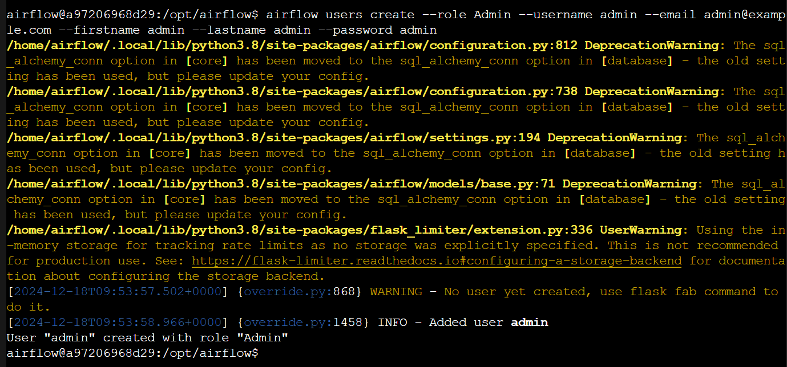
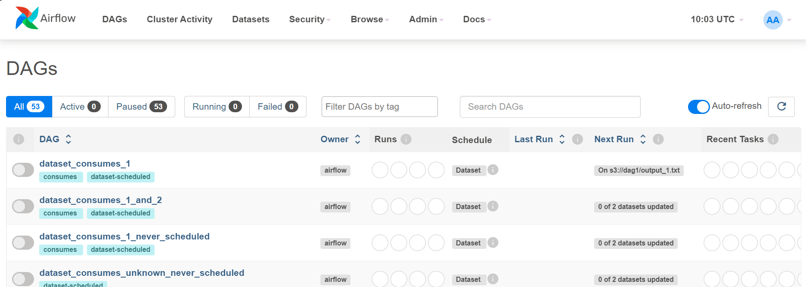
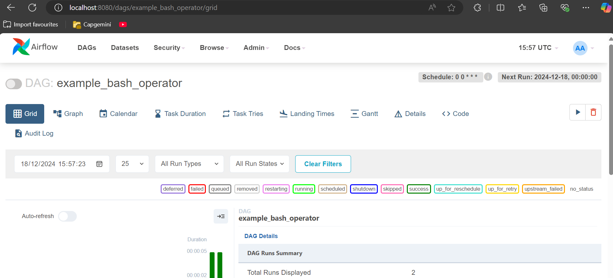

# Airflow

## default administrator user

* username: airflow
* password: airflow

```python
# _AIRFLOW_WWW_USER_USERNAME   - Username for the administrator account (if requested).
#                                Default: airflow
# _AIRFLOW_WWW_USER_PASSWORD   - Password for the administrator account (if requested).
#                                Default: airflow
```

## create a new user

```bash
airflow users create --role Admin --username admin --email admin@example.com --firstname admin --lastname admin --password admin
```



## the interface




