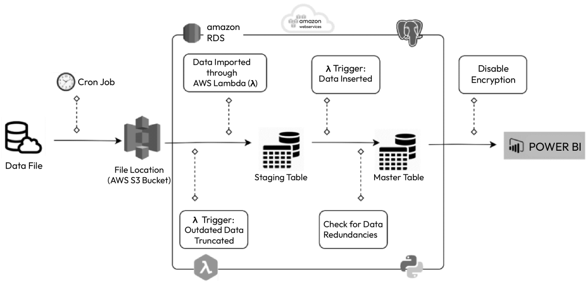
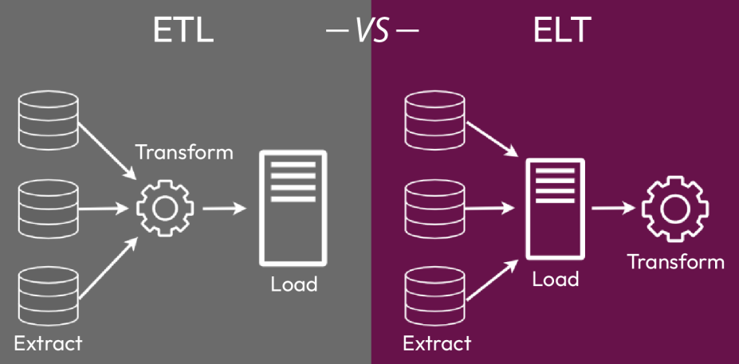
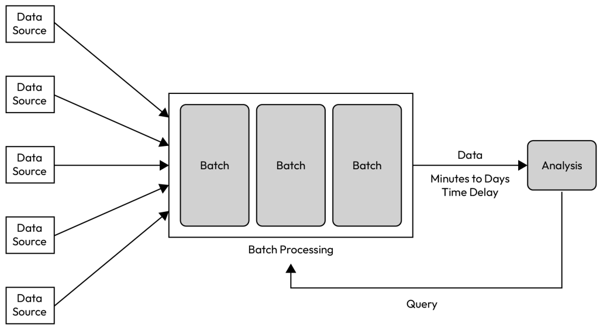

# 2 - Understanding the ETL Process and Data Pipelines

## What is a data pipeline?

A data pipeline is a series of tasks, such as transformations, filters, aggregations, and merging multiple
sources, before outputting the processed data into some target.

A robust data pipeline should have:

* Clearly defined expectations

  A robust data pipeline should have clearly defined expectations in terms of the data it is processing and the results it is expected to produce. This includes specifying the types and sources of data, as well as the desired output format and any required transformations or aggregations.

* Scalable architecture

  a robust data pipeline should have a scalable architecture that can handle increasing volumes of data without degradation in performance. This may involve using distributed systems or implementing efficient algorithms to process the data promptly

* Reproducible and clear

  The pipeline should be able to produce the same results each time it is run, and the steps involved in processing the data should be documented and easy to understand.

Steps:

* Pre-work – understanding your data

  it is important to have a clear understanding of both the input and output data structures when designing a data pipeline. This includes knowing the data structures, any potential issues with the data (such as corruption), and the frequency of new data creation for the input data. For the output data, it is important to understand the structural requirements to ensure that the pipeline consistently produces the desired result.

* Design planning – planning your workflow

  Before writing a line of code, take some time to sketch out a flowchart of the transformations that need to be performed on the input data to produce the output data. Go a little deeper into how Python packages can be used to accomplish these transformations.

* Architecture development – developing your resources

  you need to understand the various types of connections needed to securely link the source(s) of your input data to your development and production environments, as well as the method for connecting to the output location. You will also need to determine the approach for your pipeline and the level of error handling necessary to ensure the long-term stability and reliability of the pipeline.

* Putting it all together – project diagrams

  This is where you put all of the previous steps together, and add details around each component of the pipeline’s workflow to establish what needs to be designed to create the desired output data, in the desired format and storage endpoint.

  eg.

  

## What is an ETL data pipeline?

ETL stands for Extract, Transform, and Load. In an ELT process, data is first extracted from a source,
then transformed and formatted in a specific way, and finally loaded into a final storage location.

ELT stands for Extract, Load, and Transform, and is similar to ETL, but the data is first loaded into
the target system and then transformed within the target system.

ETL and ELT are data processing approaches that involve extracting data from a source, performing
transformations on it, and loading it into a final storage location. ETL is commonly used when the
source and target systems are different and the data needs to be transformed in a specific way before it
is loaded into the target system. ELT is more commonly used when the target system is more powerful
and can handle the transformation step itself. Factors to consider when deciding between ETL and
ELT include data volume, transformation requirements, source and target system capabilities, and data
latency.

Types of ETL pipelines:

* Batch processing

  Batch processing is a method of data processing that involves dividing a large volume of data into smaller pieces, or batches, and processing each batch separately. This is often done when a project requires a large amount of data to be handled (mostly in TB or above), but the downstream use of the data only requires it to be available asynchronously. Batch processing is a popular choice for handling large amounts of data because it allows engineers to design a process that can run one batch of data through the pipeline at a time, rather than trying to process all of the data at once.

  An example of this is ingesting the user’s data from an e-commerce website every 30 minutes and passing it through a pipeline to transform and load it into relational database management system (RDBMS) tables in a data warehousing setup.

  

* Streaming

  Real-time data solutions are necessary when a project needs to immediately process fresh data. Streaming methods are often used in these situations as they allow data to flow continuously, which may be variable and subject to sudden changes in structure. To handle these challenges, a combination of data pipelines is typically utilized. There are several advanced tools, such as Apache Storm and Apache Samza, that can efficiently process real-time data.

  An example of this is an e-commerce website that needs to process real-time user data as shopping is in progress. The use of real-time data processing, combined with AI/ML, can result in an enhanced user shopping experience.

* Cloud-native

  After the advent of cloud technologies, complex data processing has become very easy. Most of the famous public cloud platforms, such as Amazon Web Services (AWS), Google Cloud Platform (GCP), and Microsoft Azure, provide in-built data processing capabilities that come with various integrated tools and technologies that can be used to build a robust and resilient ETL pipeline.

## Automating ETL pipelines

* By utilizing tools such as AWS Lambda and EC2 alongside Step Functions, it is simple to orchestrate or automate ETL pipelines on a cloud platform.
* Orchestrating ETL pipelines can also be done using open source tools such as Apache Airflow, Luigi,
and others
