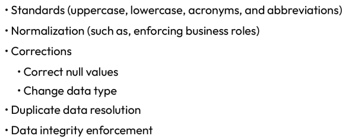

# 5 - Data Cleansing and Transformation

`5  - cleansing and tranf.ipynb`

## Data cleansing

* data cleansing, also referred to as data cleaning or scrubbing, is a term used to describe the manipulation of source data.

    It is a fundamental aspect of data engineering since unprocessed data is often quite messy and needs specific modifications to create a high-quality data output. The data cleansing process involves identifying and correcting or removing errors, inaccuracies, and inconsistencies in datasets to improve their quality and reliability. For instance, in a dataset of customer information, you might find duplicate entries, incorrect or missing values, or data in inconsistent formats.

* it occurs within the “transform” step in the extract, transform, load (ETL) or extract, load, transform (ELT) data pipeline structure.

* the Pandas library is a great place to start

```python
# example - remove nan

import pandas as pd
import numpy as np

# Create a DataFrame of Integers with some missing values
df = pd.DataFrame({
'A': [1, 2, np.nan, 4],
'B': [5, np.nan, np.nan, 8],
'C': [9, 10, 11, 12]
})

# Fill missing values with mean
df.fillna(df.mean(), inplace=True)
```

## Data transformation

Data transformation is the process of converting data from one format or structure into another. Common data transformation operations include normalization, aggregation, and generalization.



```python
# example - normalize between 0 and 1

df['A'] = (df['A'] - df['A'].min()) / (df['A'].max() - df['A'].min())
```
