# Git

## install Git

## installing Git for Windows

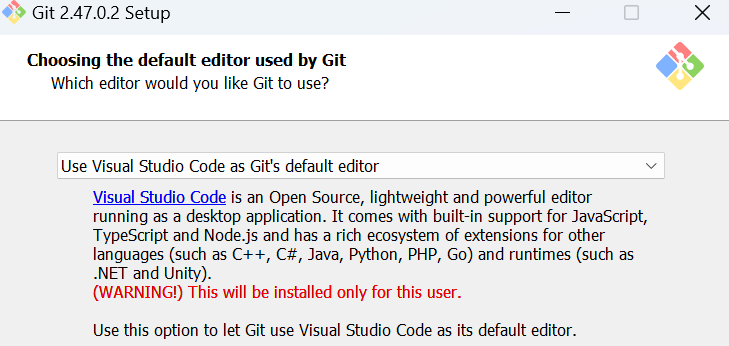

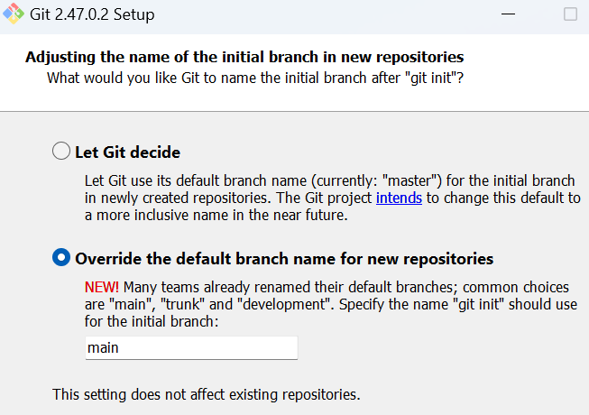

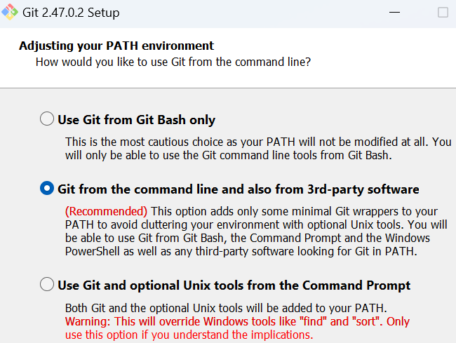

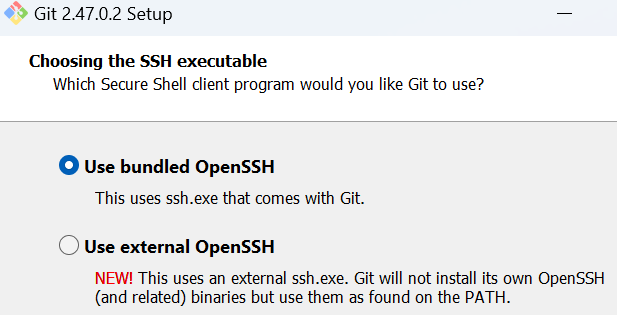

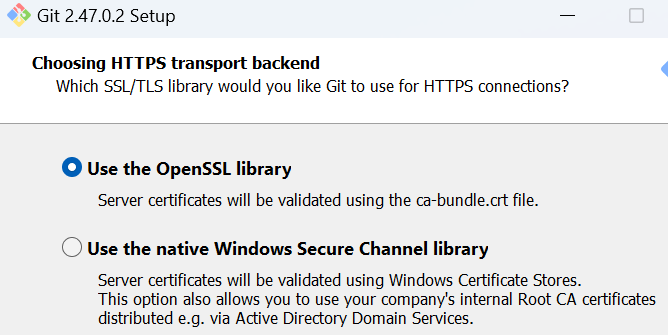

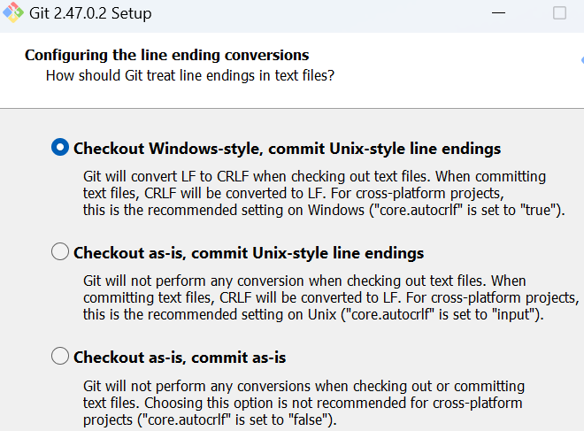

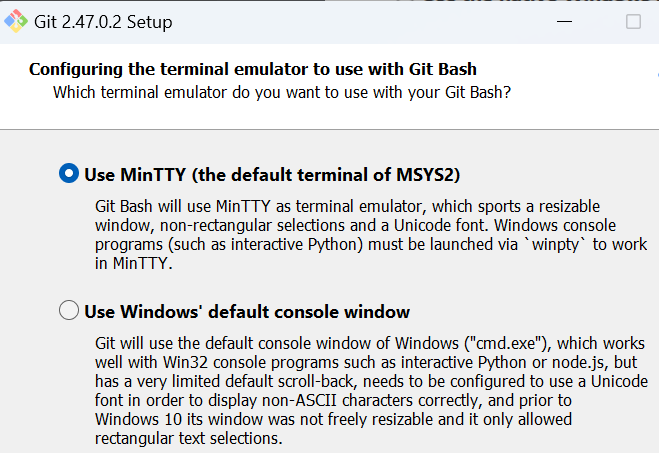

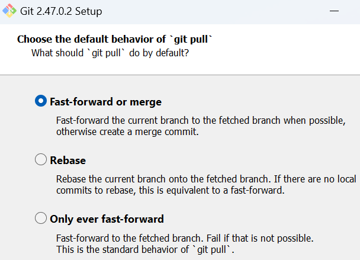

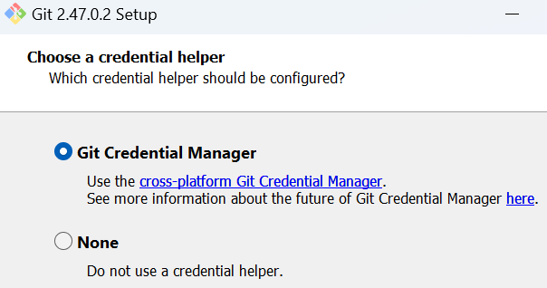

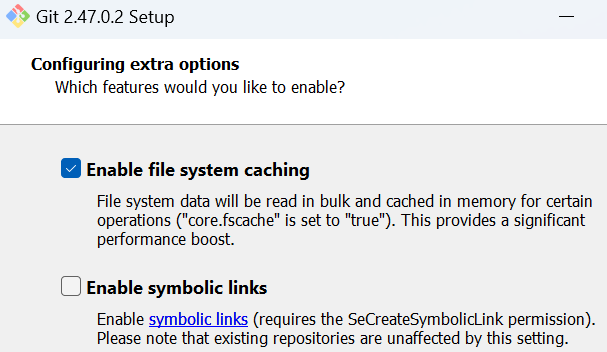

## git configuration

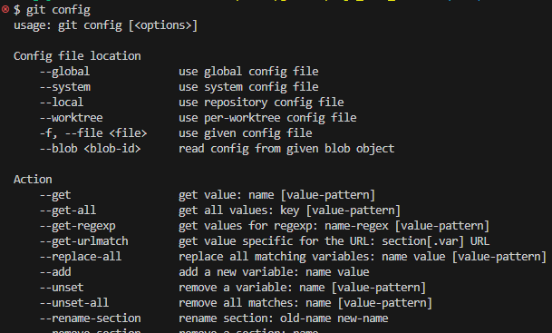

### read the existing configuration

`git config --list`

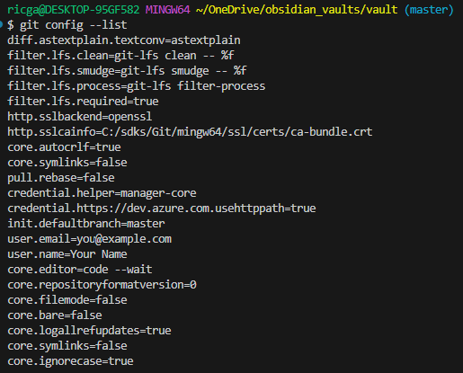

To know the username, type:

`git config user.name`

To know the email, type:

`git config user.email`

### set a configuration

You can set configurations globally or locally.

Set/update the user information (`user.name` and `user.email`)

globally

```bash
git config --global user.name "Your Name"
git config --global user.email "@example.com"
```

locally (in a specific folder)

```bash
git config --local user.name "FIRST_NAME LAST_NAME"
git config --local user.email "MY_NAME@example.com"
```

Set the editor to use (`core.editor`)

```bash
git config --global core.editor "code --wait"
# or if you want it to open in a new window
git config --global core.editor "code --wait --new-window"
```

This sets vscode as the default code editor

The global configurations are stored in a file (`~/.gitconfig`).

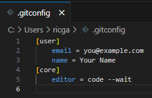

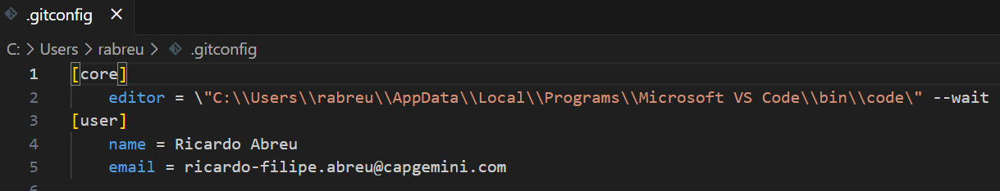

You can navigate there and change them, or you can use this command to open that file for you

```bash
git config --edit --global
```

In each git repo (`.git/`) you have a local `config` file

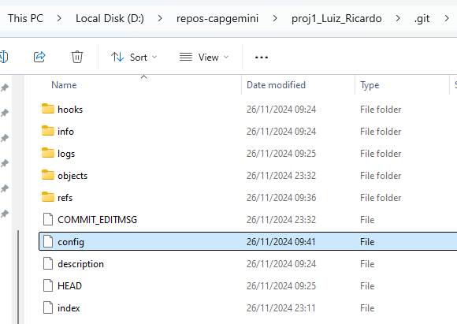

Setting a local configuration changes this file

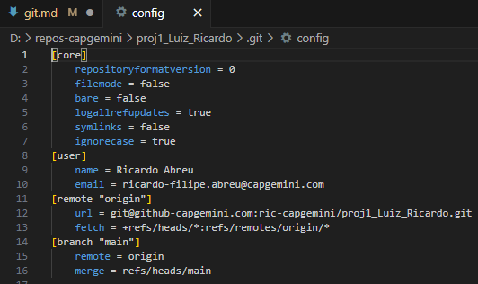

## manage multiple accounts

create a configuration file for teh SSH client. You should have something like this

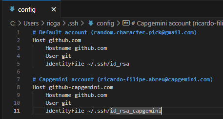

and you need to set the username and email on a per repository basis

eg. typical flow to push to a non-default account

```bash
git init
git config --local user.name "Ricardo Abreu"
git config --local user.email "ricardo-filipe.abreu@capgemini.com"
git add .
git commit -m "1st"
git branch -M main
# git remote add origin git@github-capgemini.com:<username>/<reponame>.git
git remote add origin git@github-capgemini.com:ric-capgemini/proj1_Luiz_Ricardo.git
git push -u origin main
```

## git commands

* Remove directory from Git and local

Checkout 'master' with both directories

```bash
git rm -r one-of-the-directories // This deletes from filesystem
git commit . -m "Remove duplicated directory"
git push origin <your-git-branch>
```

* Remove directory from Git but NOT local

To remove this directory from Git, but not delete it entirely from the filesystem (local)

```bash
git rm -r --cached myFolder
```

* Change the capitalization of a directory

```shell
git mv somename tmpname
git mv tmpname SomeName
```

<https://stackoverflow.com/questions/6899582/i-change-the-capitalization-of-a-directory-and-git-doesnt-seem-to-pick-up-on-it>

## resources

* [Seeker Labs - Multiple Github accounts on one computer with SSH](https://www.youtube.com/watch?v=ap56ivm0dhw)

* <https://docs.github.com/en/get-started/getting-started-with-git/setting-your-username-in-git#setting-your-git-username-for-a-single-repository>
