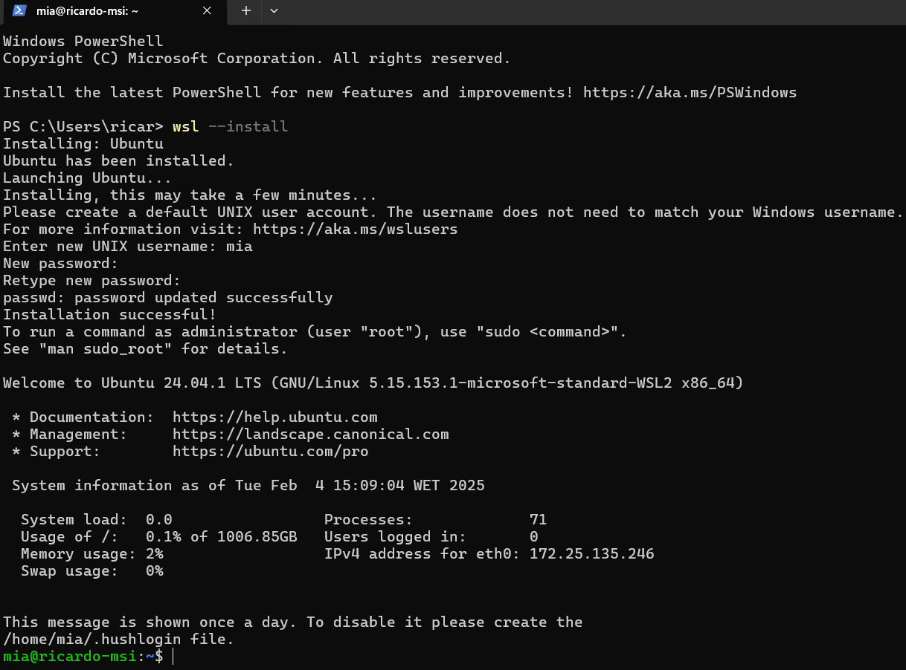
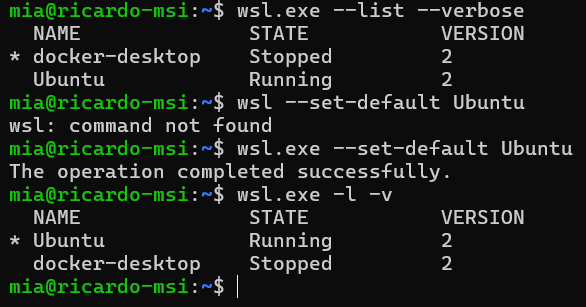
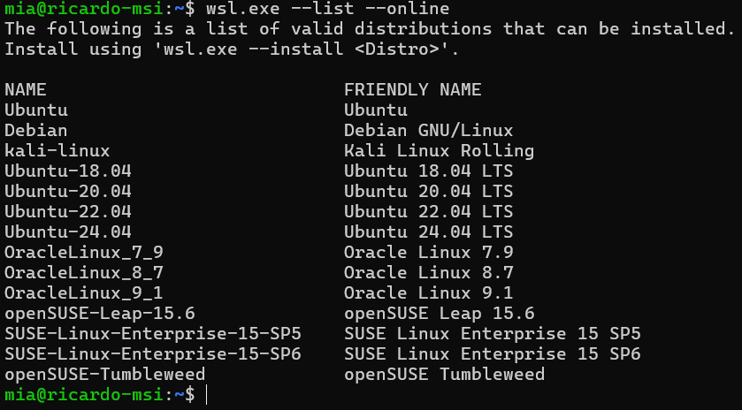
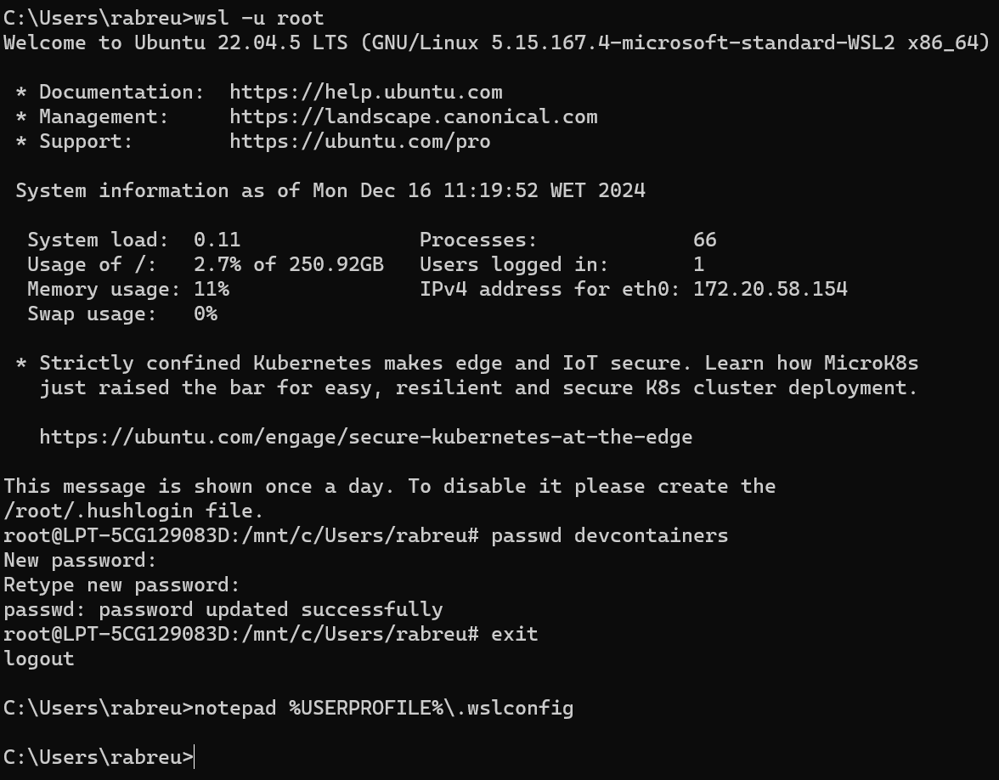
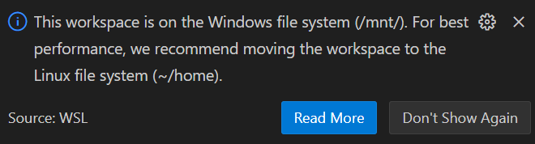

# WSL

## to learn

* [NetworkChuck - Linux on Windows](https://www.youtube.com/watch?v=vxTW22y8zV8)

## documentation

<https://learn.microsoft.com/en-gb/windows/wsl/>

## installation

(optional) Install the Terminal app from the Windows Store

```shell
# list distributions
wsl --list --verbose
wsl.exe -l -v # same thing
```

```shell
# install it
wsl --install
```



set a distribution as the default

```shell
wsl --set-default <distribution-name>

# eg
wsl --set-default Ubuntu
```



Other distros i can install

```shell
wsl --list --online
```



## launch and terminate

```shell
# run it
wsl

# switch to a different distribution
wsl -d <distribution-name>
```

Stop other distributions

```shell
wsl --terminate <distribution-name>

eg.
wsl --terminate docker-desktop
wsl --terminate docker-desktop-data
```

## users

run wsl as the root user

```bash
wsl -u root
```

changing the password for a user

```bash
passwd <user_name>
```

## WSL configuration

editing the default wsl configurations
(`~/.wslconfig`)

* you can change the default user there (eg. to root or devcontainers)



## Windows filesystem vs Linux filesystem


