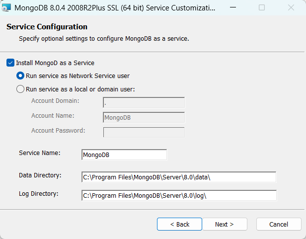
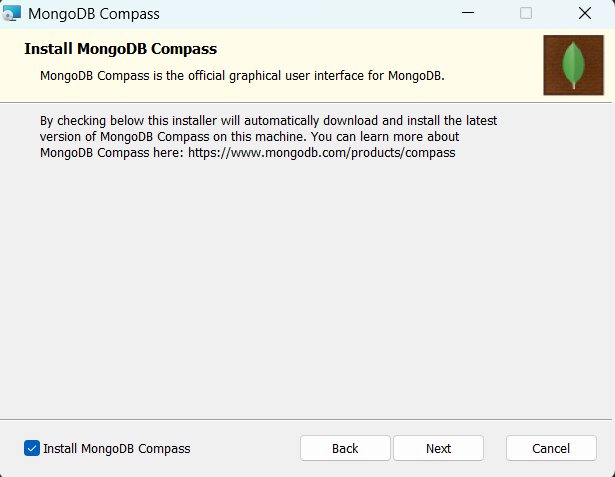
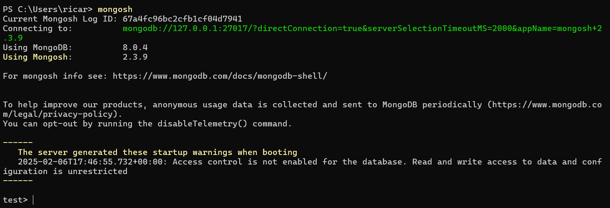
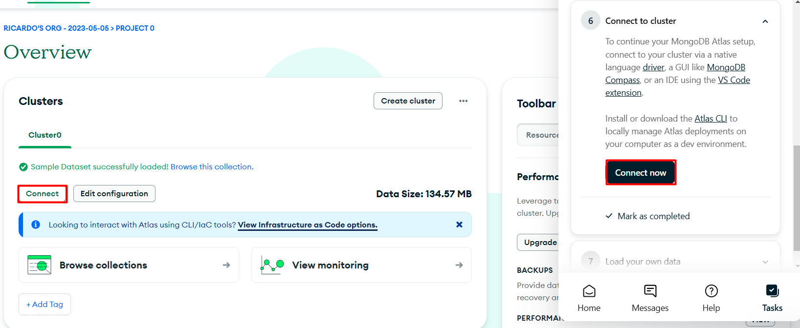

# mongodb

## Intro

MongoDB

* is a document-oriented database
* documents in MongoDB are just an ordered set of key-value pairs
* is case sensitive
* software - there are a lot of tools available for download on the website <https://www.mongodb.com/try/>
  * MongoDB Community Edition - a free version of MongoDB. You can install it on your machine (eg. on Windows or Ubuntu) or run it on docker
  * MongoDB Compass - a GUI for managing, querying, aggregating, and analyzing MongoDB data in a visual environment
  * MongoDB Atlas -  The database-as-a-service solution from MongoDB
  * MongoDB Shell (mongosh) - a command-line shell that not only performs simple CRUD operations on your database but also enables administrative tasks such as creating and deleting databases, starting and stopping services, and similar jobs
  * MongoDB Database Tools - several command-line utilities that allow administrators and developers to export or import data to and from a database, provide diagnostics, or enable manipulation of large files stored in MongoDB’s GridFS system

## Installation - MongoDB Community Edition on Windows

* <https://www.mongodb.com/docs/manual/installation/>
* <https://www.mongodb.com/try/download/community>

install it as a network service



and choose to install MongoDB Compass




there's 3 automatically generated databases: admin, config, and locals

* MongoDB Shell (mongosh)

<https://www.mongodb.com/try/download/shell>

```shell
# When you type mongosh in your terminal, it tries to connect to a MongoDB instance running on the default localhost (127.0.0.1) and port 27017, unless you specify a different URI or connection string.
mongosh
```



```shell
show dbs; # the ; is not required
```


* MongoDB Command Line Database Tools

The MongoDB Database Tools are a collection of command-line utilities for working with a MongoDB deployment. These tools release independently from the MongoDB Server schedule enabling you to receive more frequent updates and leverage new features as soon as they are available.

The Database Tools include the following binaries:

* Binary Import / Export

  * `mongodump` - Creates a binary export of the contents of a mongod database.

  * `mongorestore` - Restores data from a mongodump database dump into a mongod or mongos

  * `bsondump` - Converts BSON dump files into JSON.

* Data Import / Export

  * `mongoimport` - Imports content from an Extended JSON, CSV, or TSV export file.

  * `mongoexport` - Produces a JSON or CSV export of data stored in a mongod instance.

* Diagnostic Tools

  * `mongostat` - Provides a quick overview of the status of a currently running mongod or mongos instance.

  * `mongotop` - Provides an overview of the time a mongod instance spends reading and writing data.

* GridFS Tools

  * `mongofiles` - Supports manipulating files stored in your MongoDB instance in GridFS objects.

<https://www.mongodb.com/try/download/database-tools>

## Installation - MongoDB Community Edition on Ubuntu

If you are on WSL, install this one or the Windows one, either of them should be fine.

<https://www.mongodb.com/docs/manual/tutorial/install-mongodb-on-ubuntu/>

## using docker - MongoDB Community Edition

instead of installing, you can run it locally in containers

* <https://www.mongodb.com/docs/manual/tutorial/install-mongodb-community-with-docker/>

```yaml
services:
  mongodb:
    image: mongodb/mongodb-community-server:latest
    container_name: mongodb
    ports:
      - "27017:27017"
    command: ["--replSet", "myReplicaSet"] # Optional: Add additional options if needed
    volumes:
      - mongodb_data:/data/db

volumes:
  mongodb_data:
```

When MongoDB writes data to `/data/db` (the default directory for MongoDB storage), the volume `mongodb_data` ensures that:

* Database Files: Your collections, indexes, and all other database-related files are saved.
* Persistence: Even if the container is stopped or removed, the data will remain in the volume and can be re-used when the container is recreated.

If you want more control over where the data is stored on your host system, you can bind a host directory to the container instead of using a Docker-managed volume. For example:

```yaml
volumes:
    ./data:/data/db
```

This maps the ./data directory in your project folder to the MongoDB data directory in the container.

See `deploying mongodb (GPT).md`

## using mongodb as a managed cloud service - MongoDB Atlas

A managed database service is typically the easiest and cheapest option in the begginning, but not necessarily in the long run.

<https://www.mongodb.com/docs/atlas/getting-started/>

You can get started with Atlas through:

* the Atlas CLI - see <https://www.mongodb.com/docs/atlas/cli/current/atlas-cli-getting-started/>

* or the Atlas User Interface.
  * 1 - Create an Atlas account.

    Register for an Atlas account using your Google Account or an email address.

    <https://www.mongodb.com/cloud/atlas/register>

  * 2 - Deploy a Free cluster.

    Create and deploy a Free cluster. You can use Atlas Free clusters as a small-scale development environment to host your data. Free clusters never expire, and provide access to a subset of Atlas features.

    

    

    notice i chose to add the sample database

  * 3 - Manage database users for your cluster.

    Manage database users for your cluster. For security purposes, Atlas requires clients to authenticate as MongoDB database users to access clusters.

    create a user (with username and password) for the cluster

    

    <https://www.mongodb.com/docs/atlas/security-add-mongodb-users/>

  * 4 - Manage the IP access list.

    Manage the list of trusted IP addresses. An IP uniquely identifies a device connecting to a network. In Atlas, you can connect to a cluster only from a trusted IP address. Within Atlas, you can create a list of trusted IP addresses, referred to as an IP access list. An IP accesss list defines the IP addresses that can connect to your cluster and access your data.

    

    

    Here you can restrict address by IP. You can add your current IP address is added to enable local connectivity. If you are going to use your cluster from any other IP address, you can add that later, or you also have the option to enable access from anywhere (0.0.0.0/0), which will allow you to connect from anywhere, but this is not the recommended option for security reasons.

    <https://www.mongodb.com/docs/atlas/security/ip-access-list/>

  * 5 - Connect to your cluster.

    Before that, let's explore the sample database

    

    You can see that the sample_mflix dataset has already been loaded in your cluster. You’ll have a database named sample_mflix and six collections created under it: comments (or sample_mflix.comments), embedded_movies, movies, sessions, theatres, and users.

    

    

    <https://intercom-help.mongodb.com/en/articles/9927518-intro-to-indexes>

    

    Now, actually connect to the cluster:
    * via application/language drivers. eg. the Node.js driver, the drivers for Python (PyMongo, Motor)
    * via tools. eg. mongosh, Compass (a GUI), the VSCode extension (an IDE)

    

    

    To connect with Compass - select Compass, get that connection string and use it to create a connection inside Compass

    

    

    

    ```none
    mongodb+srv://ricardofilipesaleiroabreu:<db_password>@cluster0.kxcdj.mongodb.net/
    ```

    To connect with mongosh - select Shell, get the connection string

    

    

    ```shell
    mongosh "mongodb+srv://cluster0.kxcdj.mongodb.net/" --apiVersion 1 --username ricardofilipesaleiroabreu

    # list all databases in the cluster
    show dbs

    # use/switch to the sample database
    use sample_mflix

    # see the available collections
    show collections
    ```

  * 6 - Insert and view a document.

    * `find()`: Finds and selects documents matching simple or complex criteria. `findOne()` returns only the first document that satisfies the criteria.

    <https://www.mongodb.com/docs/manual/reference/operator/query/>

    eg.

    ```shell
    # SELECT * FROM movies;
    db.movies.find()

    # SELECT * FROM movies WHERE year = 1969 LIMIT 5;
    db.movies.find({"year": 1969}).limit(5)

    # SELECT COUNT(*) FROM movies WHERE year = 1969;
    db.movies.countDocuments({"year": 1969})

    # SELECT * FROM movies 
    # WHERE year > 1945
    #   AND countries = 'USA'
    #   AND genres = 'Comedy';
    db.movies.countDocuments({"year": {$gt: 1945}, "countries": "USA", "genres": "Comedy"})

    """
    SELECT COUNT(*)
    FROM movies
    WHERE year > 1945
      AND countries = 'USA'
      AND genres = 'Comedy';
    """
    db.movies.countDocuments({"year": {$gt: 1945}, "countries": "USA", "genres": "Comedy"})

    # $lt: Less than
    # $in: Providing a list of values
    ```

    projections also use `find()` - a projection query is just a JSON object in which the keys are the names of the fields, while the values are 0 if you want to exclude a field from the output or 1 if we want to include it. The ObjectId type is included by default, so if you want to remove it from the output, you have to set it to 0 explicitly.

    ```shell
    """
    SELECT title, countries, year
    FROM movies
    WHERE year > 1945
      AND countries = 'USA'
      AND genres = 'Comedy'
    ORDER BY year ASC
    LIMIT 5;
    """
    db.movies.find(
      {"year": {$gt: 1945}, "countries": "USA", "genres": "Comedy"},
      {"_id": 0, "title": 1, "countries": 1, "year": 1}
    ).sort({"year": 1}).limit(5)
    ```

    

    * `insertOne()`: Inserts a new document into the collection
    * `insertMany()`: Inserts an array of documents into the collection

    ```shell
    db.movies.insertOne({
      "title": "Once upon a time on Moon",
      "genres":["Test"], year: 2024
      })
    ```

    

    The first part means that MongoDB acknowledged the insertion operation, whereas the second property prints out the ObjectId key, which is the primary key that MongoDB uses and assigns automatically to the newly inserted documents if not provided manually

    ```shell
    db.movies.insertMany([
      {"title": "Once upon a time on Moon",
      "genres":["Test"], year: 2024}, 
      {"title": "Once upon a time on Mars",
      "genres":["Test"], year: 2023}, 
      {"title": "Tiger Force in Paradise",
      "genres":["Test"], year: 2019, rating: "G"}
      ])
    ```

    * `updateOne()` and `updateMany()`: Update one or more documents according to some criteria. <https://www.mongodb.com/docs/manual/reference/method/db.collection.updateOne/>

    ```shell
    # `updateOne()` updates the first encountered document
    # update the first movie whose genres field has "Test" in it and set it to "PlaceHolder" genre
    """
    UPDATE movies
    SET genres = REPLACE(genres, 'Test', 'PlaceHolder')
    WHERE genres LIKE '%Test%'
    LIMIT 1;
    """
    db.movies.updateOne({genres: "Test"}, {$set: {"genres.$": "PlaceHolder"}})

    # update all that satisfy the condition - change the genre and increment the year by 1
    """
    UPDATE movies
    SET genres = REPLACE(genres, 'Test', 'PlaceHolder'),
        year = year + 1
    WHERE genres LIKE '%Test%';
    """
    db.movies.updateMany( { "genres": "Test" }, { $set: { "genres.$":"PlaceHolder" }, $inc: { "year": 1 } } )
    ```

    * `deleteOne()` and `deleteMany()`: Delete one or more documents from the collection

    ```shell
    """
    DELETE FROM movies
    WHERE genres = 'PlaceHolder';
    """
    db.movies.deleteMany({genres: "PlaceHolder"})

    # DROP TABLE movies;
    db.movies.drop()
    ```

    * aggregations with `db.collection.aggregate()`

    <https://www.mongodb.com/docs/manual/reference/method/db.collection.aggregate/>

    It uses pipelines to define various stages/steps

    ```shell
    """
    SELECT *
    FROM movies
    WHERE genres = 'Comedy';
    """
    db.movies.aggregate([{$match: {"genres": "Comedy"}}])

    """
    SELECT AVG(runtime) AS averageRuntime
    FROM movies
    WHERE type = 'movie' AND genres = 'Comedy';
    """
    db.movies.aggregate([
      { $match: {type: "movie", genres: "Comedy" } },
      { $group: {_id: null, averageRuntime: { $avg: "$runtime" } } }
    ])
    # `_id: null` in MongoDB means no grouping key, the SQL query simply aggregates across all filtered rows.
    ```

  * 7 - Load sample data.

    Load sample data into your Atlas clusters. Atlas provides sample data that you can load into your Atlas clusters. You can use this data to quickly get started experimenting with data in MongoDB and using tools such as the Atlas UI and MongoDB Charts.

    You can also generate synthetic data that aligns to your real data's schema. To learn more, see Generate Synthetic Data.

## MongoDB - data types

<https://www.mongodb.com/docs/mongodb-shell/reference/data-types/>

* Date
* ObjectId
* Double
* Int32
* Long
* Decimal128
* Timestamp
