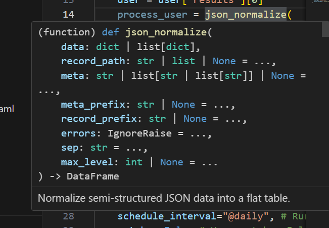

# VSCode

## suggestions

trigger them using: `Ctrl + Space`

## signature help

As you are typing, or when you hover a method, a window is shown



That window is the signature help / parameter hints. Press `Esc` to cancel out of an individual popup, or set `"editor.parameterHints.enabled": false` to disable it entirely.

## code formatting

Code Formatting Shortcut:

* Visual Studio Code on Windows - `Shift + Alt + F`
* Visual Studio Code on MacOS - `Shift + Option + F`
* Visual Studio Code on Ubuntu - `Ctrl + Shift + I`

You can also customize this shortcut using a preference setting if needed.

Code Formatting While Saving the File:

Visual Studio Code allows the user to customize the default settings. If you want to auto format your content while saving, add the below code snippet in the work space settings of Visual Studio Code.

Menu File → Preferences → Workspace Settings

```json
{
  // Controls if the editor should automatically format the line after typing
  "beautify.onSave": true,

  "editor.formatOnSave": true,

  // You can auto format any files based on the file extensions type.
  "beautify.JSfiles": [
      "js",
      "json",
      "jsbeautifyrc",
      "jshintrc",
      "ts"
  ]
}
```

## WSL

```text
View > Command Pallete> WSL: Open folder with WSL...
```
