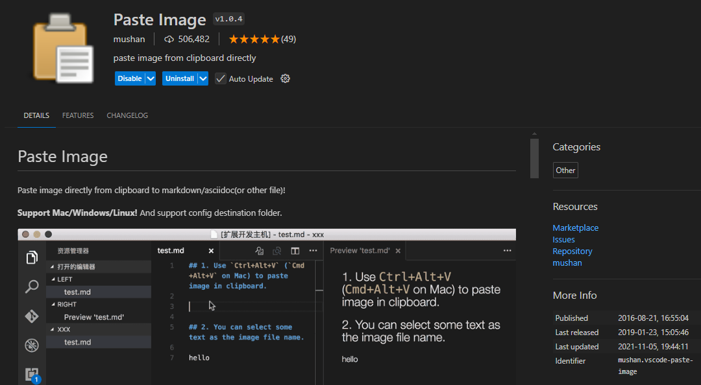
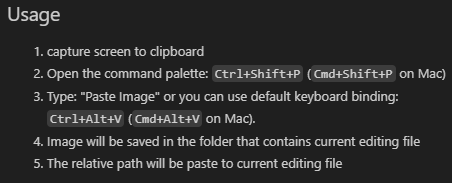

# Paste Image extension

Don't just paste the image with `Ctr+V`!

This extension gives it the timestamp, which is very convenient to identify them. Also, no bullshit spaces like the ones generated in Obsidian.

(in theory) configurable path and name





On Ubuntu, it doesn't work for me. It says you need to install xclip first, which you do like this

```bash
sudo apt install xclip
```

Doesn't work inside WSL (by default, because you are capture the input from the host)
