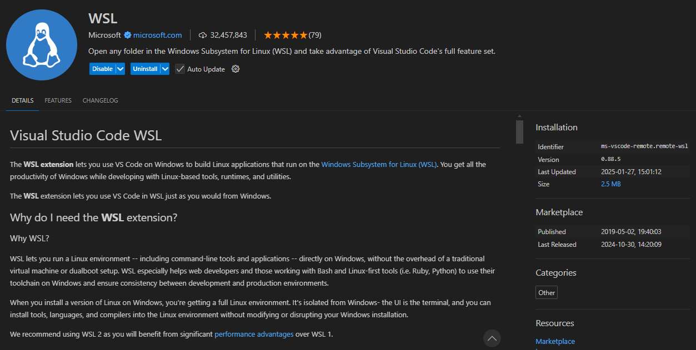
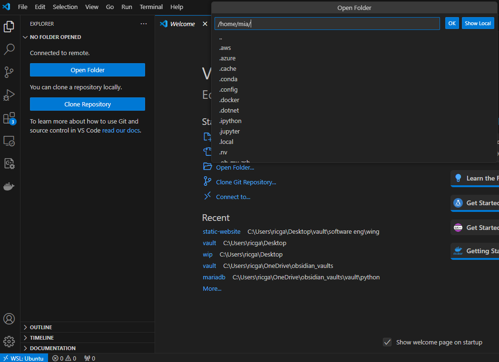
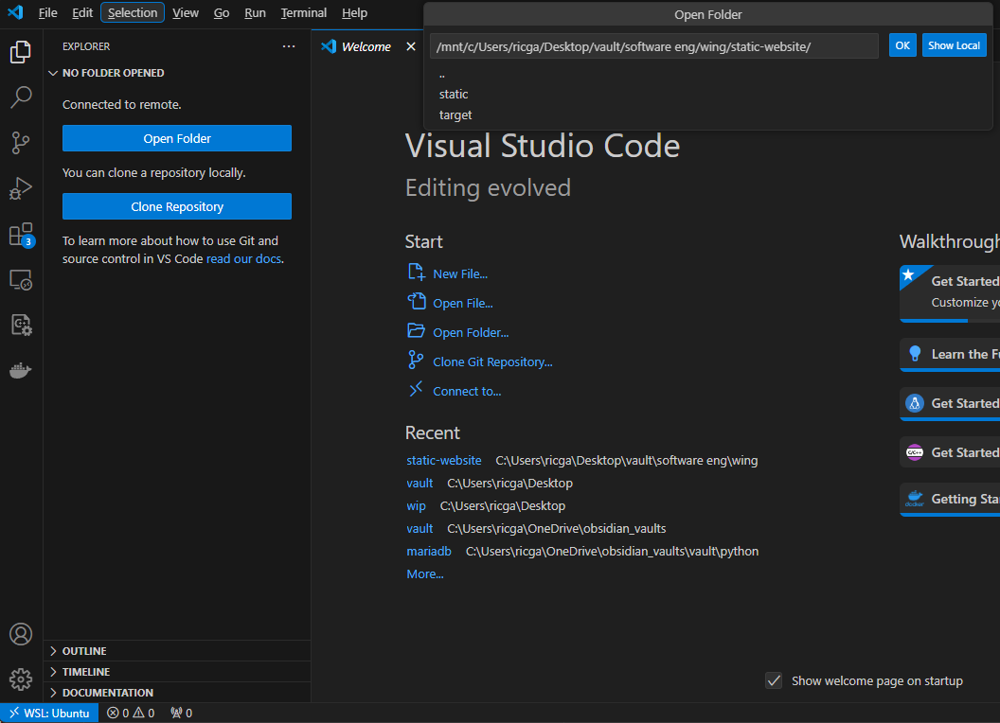

# WSL extension

## Windows - opening in WSL

you could open the folder in Windows and then connect to WSL

navigating to whatever the directory and then choose OK

An easier way is to use the Command Palette:

* Press `Ctrl+Shift+P` (or View > Command Pallete) to open it.
* Type `Remote-WSL`: Reopen Folder in WSL and select it.
* Choose the folder or file you want to open.
