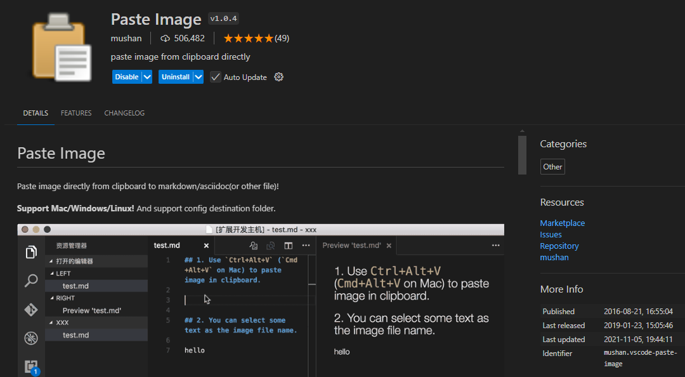
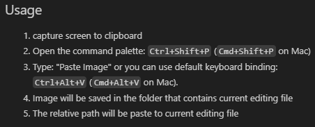

Don't just paste the image with `Ctr+V`!

This extension gives it the timestamp, which is very convenient to identify them. Also, no bullshit spaces like the ones generated in Obsidian.

(in theory) configurable path and name

