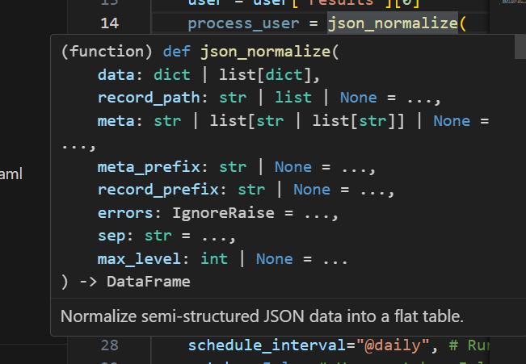

# VSCode

## suggestions

trigger them using: `Ctrl + Space`

## signature help

As you are typing, or when you hover a method, a window is shown

That window is the signature help / parameter hints. Press `Esc` to cancel out of an individual popup, or set `"editor.parameterHints.enabled": false` to disable it entirely.
